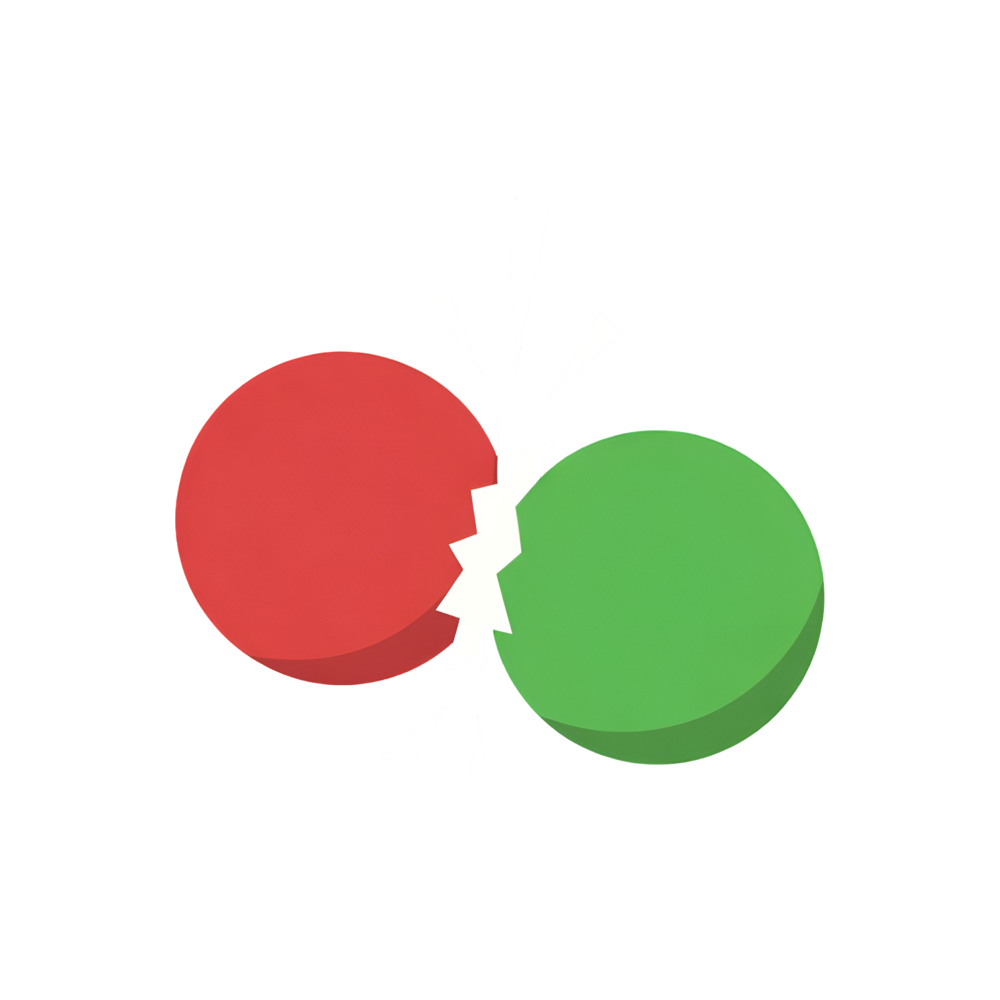
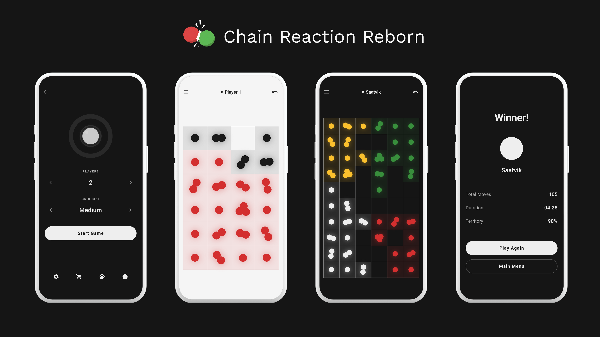

<div align="center">



<br>

**A polished, modern reimplementation of the classic atomic strategy game.**

[](https://flutter.dev) [](https://github.com/saatvik333/chain-reaction-reborn/releases) [](LICENSE) [](https://github.com/sponsors/saatvik333)

</div>

---

## Overview

**Chain Reaction Reborn** is a cross-platform strategy game built with Flutter.

Place atoms, trigger chain reactions, capture enemy cells, and eliminate all opponents. Play locally with friends or against multi-tier AI.



## Features

- **Classic Chain Reaction Rules**
  - Corner critical mass: 2
  - Edge critical mass: 3
  - Center critical mass: 4
  - Chain reactions capture neighboring cells
- **AI Difficulties**
  - **Easy**: random valid moves
  - **Medium**: greedy tactical heuristics (immediate explosions, safety checks)
  - **Hard**: 1-ply strategic evaluation with heuristics + limited humanization
  - **Extreme**: depth-2 minimax with alpha-beta pruning
  - **God**: strongest tier, deeper minimax with alpha-beta pruning and move ordering
- **Local Multiplayer**
  - 2 to 8 players on one device
- **Responsive UI**
  - mobile single-column and tablet/desktop two-pane home layouts
  - keyboard navigation in game grid (arrows + Enter/Space)
- **Customization**
  - light/dark mode and multiple visual toggles
  - editable player names
  - theme system with premium theme packs
- **Shop / Support**
  - in-app purchases for premium themes
  - support option (buy me a coffee), with external-link fallback
- **Desktop Integration**
  - menu bar, fullscreen toggle (`F11`), quit (`Ctrl+Q`), back (`Esc`)

## Platform Support

- **Mobile**: Android, iOS
- **Desktop**: Windows, Linux, macOS

## Tech Stack

- Flutter + Dart
- Riverpod (`flutter_riverpod`, `riverpod_annotation`)
- GoRouter
- Freezed + JSON Serializable
- SharedPreferences + Flutter Secure Storage
- In-App Purchase (`in_app_purchase`)
- Window Manager (`window_manager`)

## Architecture

The app uses a feature-first architecture with clear domain/data/presentation boundaries per feature.

Read the full technical reference here: [architecture.md](architecture.md)

## Project Structure

```text
lib/
├── core/            # Shared constants, theme, reusable widgets, utilities
├── features/
│   ├── game/        # Game engine, AI, gameplay providers/screens/widgets
│   ├── home/        # Home flow (mode selection + configuration)
│   ├── settings/    # Settings repository, providers, screen
│   └── shop/        # Shop providers, IAP services, palette/shop screens
├── l10n/            # Localization resources (ARB + generated)
├── routing/         # Route constants and GoRouter setup
└── main.dart        # App bootstrap and ProviderScope wiring
```

## Getting Started

### Prerequisites

- Flutter SDK 3.10.7+
- Dart SDK (matching Flutter)

### Installation

```bash
git clone https://github.com/saatvik333/chain-reaction-reborn.git
cd chain-reaction-reborn
flutter pub get
```

### Run

```bash
# Android / iOS / Desktop
flutter run

# Example desktop target
flutter run -d linux
```

### Test

```bash
flutter test
```

## Release Build

```bash
# Android APK
flutter build apk --release

# Linux
flutter build linux --release
```

## Notes

- In debug mode, premium themes are auto-unlocked for development/testing.
- Purchase validation configuration differs by platform and environment.

## License

Licensed under **GNU GPL v3.0**. See [LICENSE](LICENSE).
