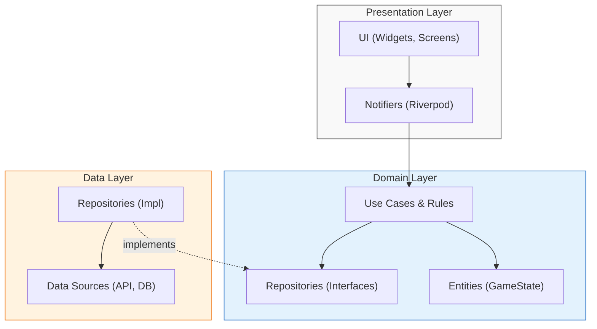
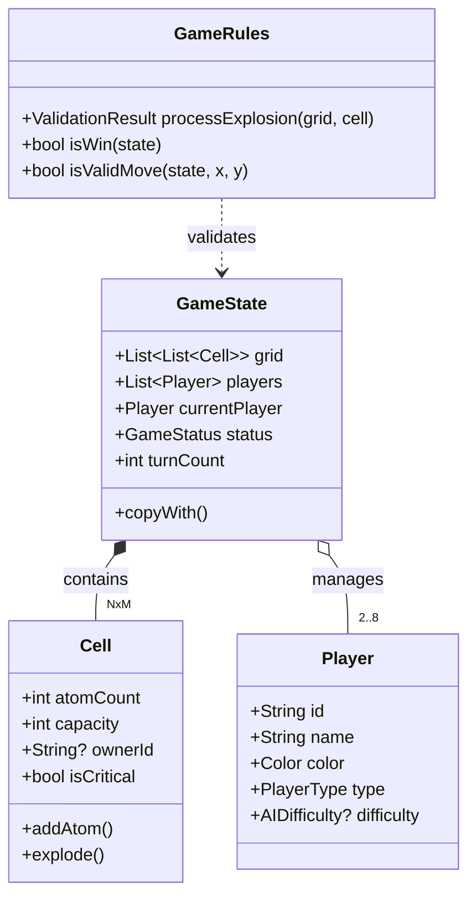
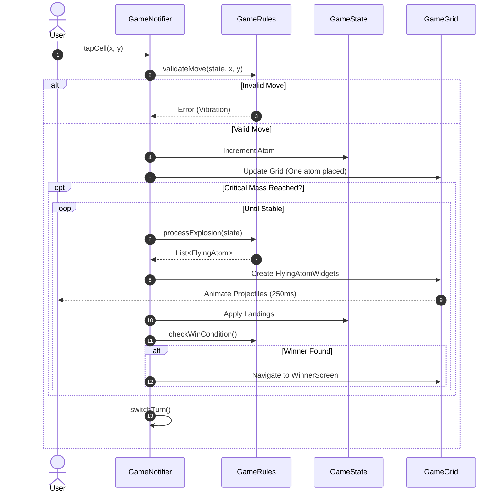
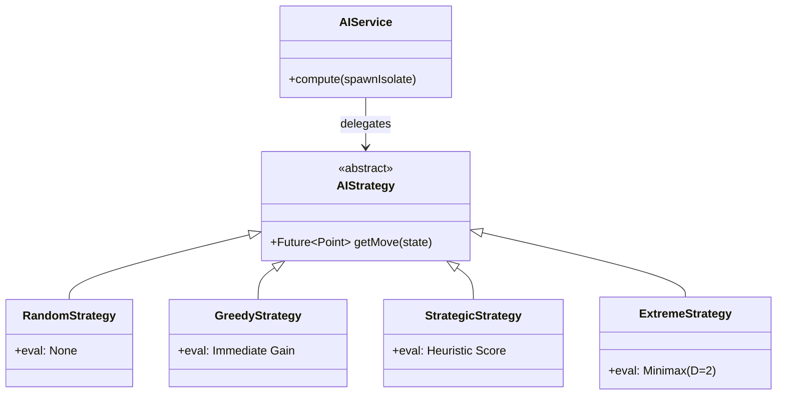
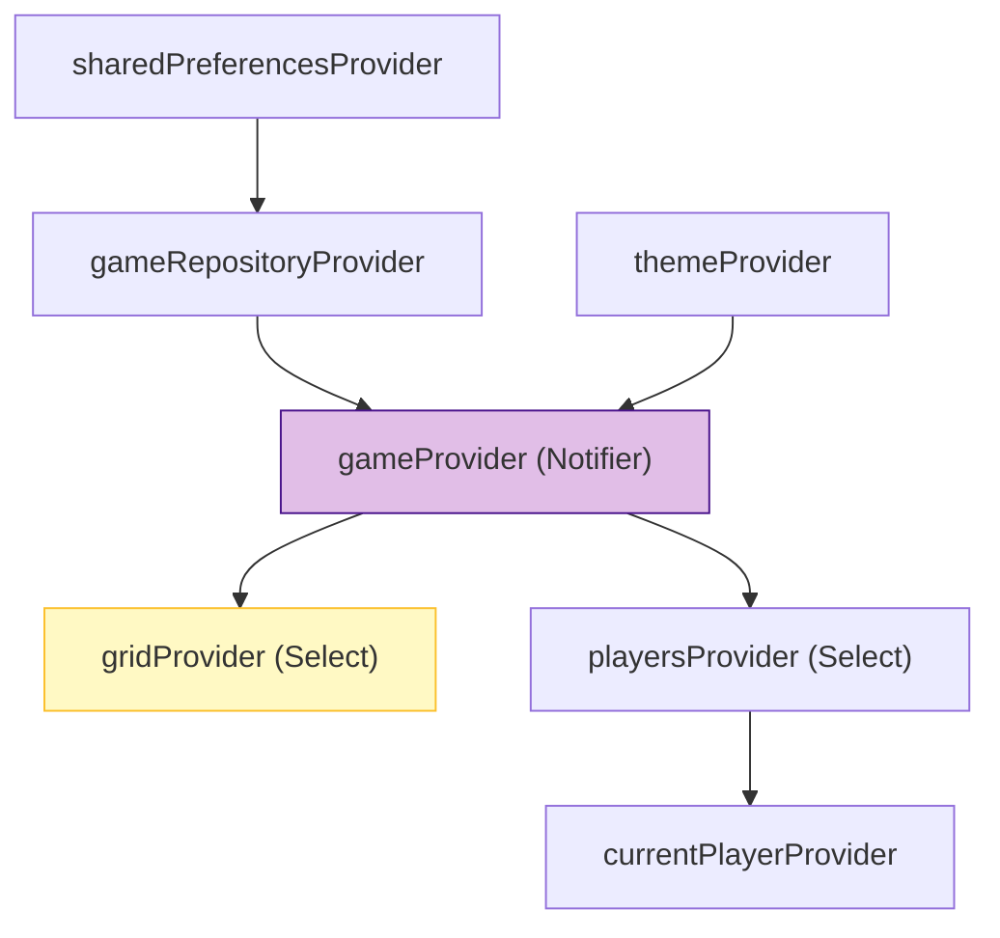
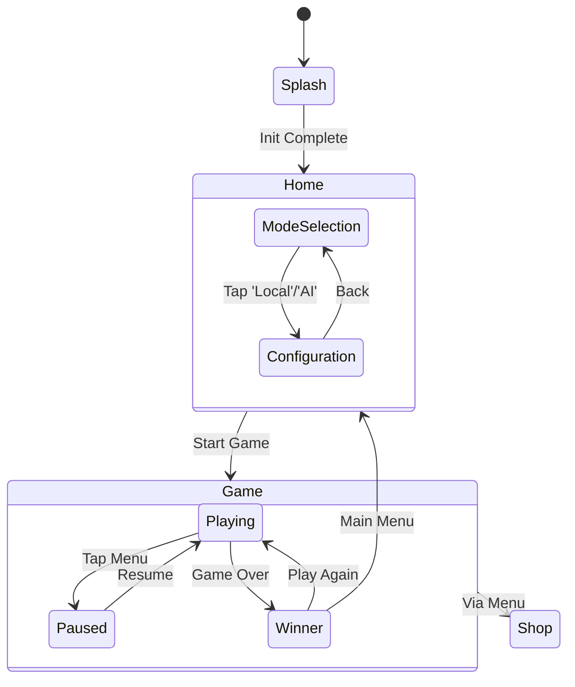

# Chain Reaction Reborn - Comprehensive Technical Architecture

**Version**: 1.2.0
**Last Updated**: February 2026
**Maintainer**: Saatvik

This document serves as the **authoritative technical reference** for the Chain Reaction Reborn project. It creates a complete mental model of the system, ranging from high-level architectural patterns to low-level algorithmic implementations.

---

## 1. Executive Summary

**Chain Reaction Reborn** is a modern, cross-platform (Android, iOS, Windows, Linux, macOS) remake of the classic strategic board game. It is built with **Flutter** and adheres to strict engineering standards to ensure scalability, testability, and performance.

### Core Technology Stack
*   **Framework**: Flutter (Dart 3.x)
*   **State Management**: `flutter_riverpod` (v3.x) with Code Generation.
*   **Navigation**: `go_router` (Declarative Routing).
*   **Immutability**: `freezed` & `equatable`.
*   **Dependency Injection**: Riverpod (Service Locator pattern).
*   **Serialization**: `json_serializable`.
*   **Persistence**: `shared_preferences`.
*   **Platform Integration**: `window_manager` (Desktop), `in_app_purchase` (Mobile).
*   **Linting**: `very_good_analysis`.

---

## 2. High-Level Architecture

The functionality is structured using **Feature-First Clean Architecture**. This approach prevents the "monolithic layer" problem (e.g., a folder with 50 unrelated controllers) by grouping code by business domain first.

### Architectural Diagram



### Layer Definitions

1.  **Presentation Layer**:
    *   **Responsibility**: Rendering UI and handling user input.
    *   **Components**: Flutter Widgets, Pages, Dialogs.
    *   **State**: Driven by Riverpod `Notifiers`. The UI never mutates state directly; it dispatches events (methods) to the Notifiers.
    *   **Constraint**: The UI layer **must not** contain business logic. It implies logic by calling methods like `notifier.placeAtom()`.

2.  **Domain Layer (The "Brain")**:
    *   **Responsibility**: Enforcing the rules of Chain Reaction.
    *   **Components**:
        *   **Entities**: Immutable data objects (POJOs).
        *   **Logic**: Pure Dart classes (e.g., `GameRules`) that perform calculations.
        *   **Interfaces**: Abstract definitions of how data is fetched.
    *   **Constraint**: This layer has **zero dependencies** on Flutter UI, serialization libraries, or data sources. It is pure Dart.

3.  **Data Layer**:
    *   **Responsibility**: Talking to the "outside world".
    *   **Components**: Repository implementations, API clients, Database wrappers.
    *   **Constraint**: It converts external data formats (JSON, DB rows) into Domain Entities.

---

## 3. Detailed Directory Structure

The project structure is designed for scalability. As the app grows, we add new feature folders rather than bloating existing ones.

```text
lib/
├── core/                                # GLOBAL SHARED RESOURCES
│   ├── constants/                       # AppDimensions, Strings, Timeouts
│   ├── errors/                          # DomainExceptions, Failure classes
│   ├── extensions/                      # Dart extensions (Context, String)
│   ├── presentation/
│   │   └── widgets/                     # Reusable: Buttons, Dialogs, Wrappers
│   ├── routing/                         # AppRouter, RouteNames, Safe Types
│   ├── theme/                           # AppTheme, Color Palettes, Fonts
│   └── utils/                           # JsonConverters, Logger
├── features/                            # VERTICAL SLICES
│   ├── game/                            # [CORE] The Game Engine
│   │   ├── data/
│   │   │   └── repositories/            # GameRepositoryImpl
│   │   ├── domain/
│   │   │   ├── ai/                      # AI Service & Strategies
│   │   │   ├── entities/                # GameState, Cell, FlyingAtom
│   │   │   ├── logic/                   # GameRules (Explosion Logic)
│   │   │   └── repositories/            # IGameRepository
│   │   └── presentation/
│   │       ├── painters/                # CustomPainters for high-perf grids
│   │       ├── providers/               # GameNotifier, GridProvider
│   │       ├── screens/                 # GameScreen, WinnerScreen
│   │       └── widgets/                 # GameGrid, ScopedCellWidget
│   ├── home/                            # [FEATURE] Setup Wizard
│   │   └── presentation/                # Steps: Mode -> Config -> Start
│   ├── settings/                        # [FEATURE] Preferences
│   └── shop/                            # [FEATURE] Marketplace & IAP
├── l10n/                                # Localized Strings (.arb)
└── main.dart                            # Entry Point & ProviderScope
```

---

## 4. Domain Modeling & Entities

The game state is modeled using **Immutable Data Structures**. This prevents an entire class of bugs related to shared mutable state and enables features like "Undo" and "Replay" trivially.

### Class Diagram



### Key Entities
*   **`GameState`**: The root aggregate. Contains the entire snapshot of a game at time `t`.
*   **`Cell`**: Represents a single grid node. It knows its `capacity` (neighbors count) and current `atomCount`.
*   **`Player`**: A participant. Can be local human, or AI.

---

## 5. The Core Engine: Recursive Propagation

The defining mechanic of Chain Reaction is the critical mass explosion. Code is located in `lib/features/game/domain/logic/game_rules.dart`.

### Algorithm Complexity
*   **Time Complexity**: In the worst case (full board chain reaction), an explosion touches every cell `O(N*M)`.
*   **Space Complexity**: `O(N*M)` for the BFS queue.
*   The algorithm is synchronous to ensure atomic state updates, but the *visuals* are asynchronous.

### Execution Flow Sequence



---

## 6. Artificial Intelligence System

The AI runs in a background **Isolate** (`compute`). This is critical because Minimax algorithms with deep recursion would otherwise freeze the main (UI) thread, causing frame drops.

### Strategy Pattern Implementation

We define an abstract `AIStrategy` interface, allowing us to swap difficulty levels at runtime.



### Detailed Strategies
1.  **Random**: `O(1)`. Selects random index from `validMoves`.
2.  **Greedy**: `O(M)`. Simulates 1 move ahead for all candidates. Picks the one creating the largest delta in `(myAtoms - enemyAtoms)`.
3.  **Strategic**: `O(M)`.
    *   **Heuristics**:
        *   Material Advantage (1.5x weight)
        *   Territorial Control (1.0x weight)
        *   Chain Reaction Potential (5.0x weight)
        *   **Vulnerability Penalty**: Checks neighbors. If placing an atom puts it next to an enemy critical mass, score `-5.0`.
    *   **Humanization**: Has a 25% chance to ignore the best move and pick a random valid one.
4.  **Extreme (Minimax)**:
    *   **Algorithm**: Depth-limited Minimax.
    *   **Depth 1**: Maximizes self-gain.
    *   **Depth 2**: Simulates opponent's *best possible response* to that move and minimizes the final outcome.
    *   **Lapse Factor**: 22% chance to skip Depth 2 calculation, simulating a "blunder".

---

## 7. State Management (Riverpod Graph)

We use a hierarchical provider structure.



*   **Optimization**: The `GameGrid` widget does *not* listen to `gameProvider`. It listens to `gridProvider`, which is a `select` projection. This ensures the grid only rebuilds when the atoms change, not when the `turnCount` or `timer` updates.

---

## 8. Rendering Pipeline & Visuals

To achieve 60 FPS on lower-end devices with 50+ animating atoms, we use a **Hybrid Rendering Stack**.

### Layer 1: The Stable Grid (Canvas)
*   **Technology**: `CustomPainter`.
*   **Why**: Flutter's Widget tree overhead is too high for 64 cells x 3 atoms = 192 potentially animating widgets.
*   **Implementation**: `ScopedCellWidget` paints the cell background, lines, and stable atoms directly to the canvas.
*   **Animation**: A global `AnimationController` in `GameGrid` ticks from 0.0 to 1.0. The painter reads this value to scale/rotate atoms for the "breathing" effect. usage: `transform = Matrix4.identity()..rotateZ(animation.value * 2 * pi)`.

### Layer 2: The Flying Atoms (Widgets)
*   **Technology**: Standard Widgets (`Stack` + `Positioned`).
*   **Why**: Complex trajectories (Beziers) and shadows are easier to implement with widgets context than raw canvas math. Since there are rarely more than 5-10 projectiles at once, the widget overhead is negligible.
*   **Lifecycle**:
    1.  Explosion Event triggered.
    2.  `FlyingAtom` entities added to `flyingAtomsProvider`.
    3.  `GameGrid` Stack renders `FlyingAtomWidget` at `startPosition`.
    4.  Widget animates to `endPosition` over 250ms.
    5.  Logical update commits, and widget is removed.

---

## 9. Navigation & Routing

We use **GoRouter** for URL-based navigation, enabling deep linking and simple state restoration.



---

## 10. Platform Integration

The project is designed as a **Universal App**.

### Desktop (Windows / Linux / macOS)
*   **Window Management**: Uses `window_manager` to remove the default title bar and implement a custom, themed title bar.
*   **Dimensions**:
    *   Min Size: 800x600.
    *   Default: 1024x768.
*   **Shortcuts**:
    *   `F11`: Toggle Fullscreen.
    *   `Ctrl+Q` (Command+Q): Quit.
    *   `Esc`: Back navigation.
*   **Mouse**: Supports back side-button (button 8).

### Mobile (Android / iOS)
*   **Orientation**: Locked to Portrait mode for optimal gameplay.
*   **Haptics**: Uses `HapticFeedback.lightImpact()` for atom placement and `heavyImpact()` for explosions.
*   **Display**: Supports High Refresh Rate (90Hz/120Hz) via `flutter_displaymode`.

---

## 11. Services & Data Storage

### Shop System & IAP
*   **Provider**: `in_app_purchase` (official plugin).
*   **Flow**:
    ```mermaid
    sequenceDiagram
        User->>ShopNotifier: Buy "Earthy Theme"
        ShopNotifier->>IAP_Service: buyNonConsumable(id)
        IAP_Service->>Store: Request Payment
        Store-->>IAP_Service: Success (Token)
        IAP_Service->>ShopNotifier: Stream<PurchaseDetails>
        ShopNotifier->>ShopRepo: savePurchase('Earthy')
        ShopRepo->>Disk: write 'purchased_themes'
        ShopNotifier-->>UI: Update Theme List (Unlock)
    ```
*   **Restoration**: `restorePurchases()` checks the store for past transactions and re-syncs local storage.

### Persistence
*   **Key**: `game_repository_impl.dart`.
*   **Mechanism**: JSON Serialization.
*   **Triggers**: Logic saves state `onTurnEnd`.
*   **Schema**:
    ```json
    {
      "grid": [[{"atomCount": 1, "owner": "p1"}, ...]],
      "players": [{"id": "p1", "color": 4294967295}],
      "currentPlayer": "p1"
    }
    ```

---

## 12. Quality Assurance Standards

We maintain codebase health through automated enforcement.

### Linting
*   **Package**: `very_good_analysis`.
*   **Key Rules**:
    *   `public_member_api_docs`: Enforced for Core components.
    *   `sort_constructors_first`: Readability.
    *   `avoid_dynamic`: Strict typing.
    *   `unawaited_futures`: Must explicit wrap fire-and-forget futures.

### Testing Strategy
1.  **Unit Tests**:
    *   Cover all `GameRules` edge cases (corner explosions, suicides).
    *   Mock `Repositories` to test `Notifiers` in isolation.
2.  **Widget Tests**:
    *   Pump `GameScreen` and simulate taps.
    *   Verify `winner_screen` appears on condition.
3.  **Integration Tests**:
    *   (Planned) Full end-to-end playthroughs.
