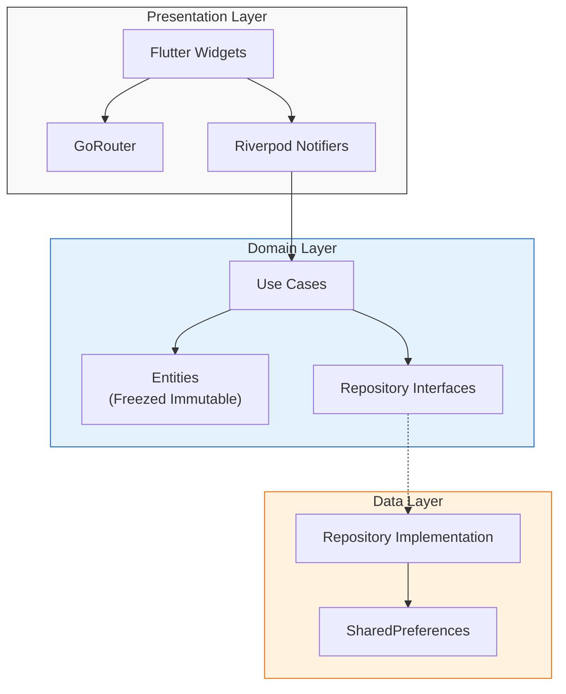
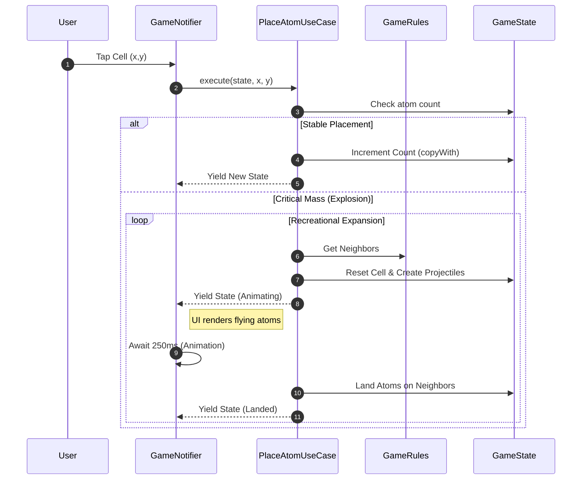
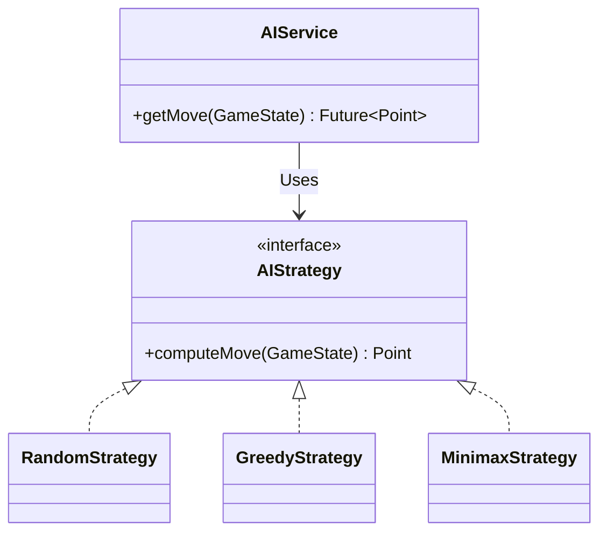
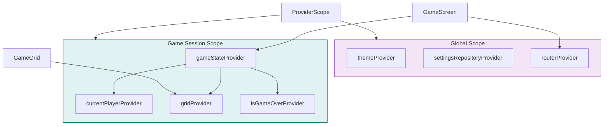
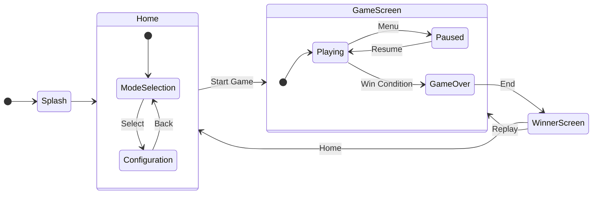

# Chain Reaction Reborn - Technical Architecture

This document provides a deep technical dive into the **Chain Reaction Reborn** project. It covers the architectural patterns, state management strategy, core game algorithms, and component interactions using Mermaid diagrams.

## 1. High-Level Architecture
The project follows a **Feature-First Clean Architecture**. Code is organized primarily by *feature* (vertical slices) and then by *layer* (horizontal slices).

### Architectural Layers
- **Presentation**: UI widgets, screens, and Riverpod Notifiers (State Management). Uses **GoRouter** for declarative navigation.
- **Domain**: Pure Dart business logic, **Freezed** Entities (Immutable), Use Cases, and Repository Interfaces.
- **Data**: Implementation of Repositories, Data Sources (SharedPreferences), and DTOs.



## 2. Directory Structure
The codebase uses a standard scalable folder structure:

```text
lib/
├── core/                  # Shared utilities
│   ├── routing/           # GoRouter configuration
│   ├── theme/             # App Theme & Palettes
│   └── utils/             # JsonConverters, Constants
├── l10n/                  # Localization (Arb files, Generated Code)
├── features/
│   ├── game/              # CORE FEATURE: Game Board, Logic, AI
│   ├── home/              # Entry point wizard (Mode Selection)
│   ├── settings/          # User Preferences
│   └── shop/              # Theme Marketplace
├── widgets/               # Reusable UI components (Buttons, Dialogs)
└── main.dart              # App bootstrapping
```

## 3. Core Game Logic
The heart of the application is the `features/game` module. It handles the turn-based logic, recursion, and animations.

### The Chain Reaction Algorithm
The game relies on a recursive propagation logic when a cell reaches critical mass. Domain entities (`Cell`, `GameState`, `Player`, `FlyingAtom`) are **immutable** and generated using `freezed`.



### AI Engine
The AI uses a **Strategy Pattern** to support multiple difficulty levels.


- **Random**: Picks any valid cell.
- **Greedy**: Prioritizes moves that capture the most cells immediately.
- **Minimax**: A depth-limited search (Depth=2) that simulates user responses to minimize the opponent's maximum possible gain. It runs in a background **Isolate** to avoid freezing the UI.

## 4. State Management (Riverpod)
We use `NotifierProvider` for complex state and `Provider` for read-only values.

### Provider Graph used in `GameScreen`


## 5. Navigation Flow
The app uses **Declarative Navigation** via `go_router`. All routes are defined in `AppRouter`.



## 6. Rendering Pipeline
The game grid is too dense for standard Flutter widgets (`Container`, `Column`, `Row`) to animate efficiently at 60fps on low-end devices.

### Key Optimization: `CustomPainter`
Instead of widgets, atoms are drawn directly onto the canvas.
- **`AtomPainter`**: Handles drawing the circles, shadows, and rotation.
- **`GameGrid`**: Contains a single `AnimationController` that drives the "breathing" and "rotation" of *all* atoms simultaneously.

```dart
// Simplified Logic
void paint(Canvas canvas, Size size) {
    for (var atom in atoms) {
       // 1. Calc Rotation based on global animation value
       // 2. Calc 'Breathing' scale (Sine wave)
       // 3. Draw Circle
    }
}
```

## 7. Data Persistence
Persistence is handled by `shared_preferences` behind Repository interfaces.

| Feature | Data Stored | Key Example |
| :--- | :--- | :--- |
| **Settings** | Booleans, Strings | `isDarkMode`, `isSoundOn` |
| **Shop** | List of Strings | `purchased_themes` |
| **Game** | JSON Blob | `active_game_state` |

The `GameRepository` serializes the entire `GameState` object using `AppJsonConverters` and `freezed`'s `toJson` logic to support "Resume Game" functionality. A custom `ColorConverter` handles standardizing color values.

## 8. Internationalization (l10n)
The project supports multiple languages (currently English) using `flutter_localizations`.

### Workflow
1. **Source of Truth**: `lib/l10n/arb/app_en.arb` (JSON-like key-values).
2. **Generation**: `flutter gen-l10n` reads ARB files and generates Dart code in `lib/l10n/generated/`.
3. **Usage**: `AppLocalizations.of(context)!.keyName`.

### Key Components
- **`AppLocalizations`**: The generated class containing all localized strings.
- **`l10n.yaml`**: Configuration file defining input/output directories.
